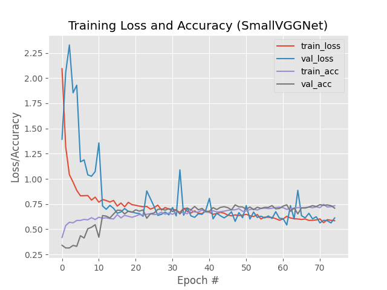

# Image classification with Keras and deep learning
The purpose of this program is to correctly classify the content of an image as
- dog
- cat
- panda

The dataset must be downloaded in the animals/ directory. At least 1000 images of each animals must be used to obtain accurate results.

Convolutional Neural Network (CNNs) is used since it is designed to operate over the raw pixel intensities of images and learn discriminating filters that can be used to classify image with high accuracy.

## Approach
1. Resize of image to 64x64
2. Image Augmentation
3. ReLU - outputs the input directly if it is positive, otherwise output zero
4. Batch Normalization - normalizes the output of a previous layer to stabilize neural networks
5. MaxPool
6. Dropout - randomly selected neurons are ignored duting the training

---

## Installation
### Clone
> Clone this repo to your local machine using `https://github.com/super-hxman/AnimalRecognition.git`

### Setup/Requirements
> The following libraries are needed
> - keras
> - OpenCV
> - argparse
> - pickle
> - sklearn
> - imutils
> - matplotlib
> - numpy
> - random
> - pickle
> - os

---

## Execution
Command to train the model: 
`$ python train_vgg.py --dataset animals --model output/smallvggnet.model --label-bin output/smallvggnet_lb.pickle --plot output/smallvggnet_plot.png`

Command to make prediction:
`$ python predict.py --image images/panda.jpg --model output/smallvggnet.model \`

---

## Results
The following is an image of the resulting training plot present in the output/ directory.

The graph can be used to determine whether there is `overfitting` or `underfitting`.

## Predictions

 

---

